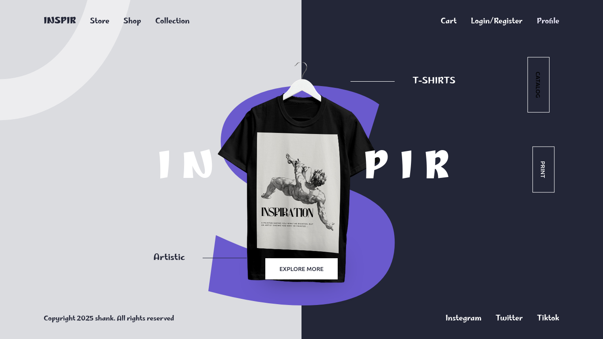

# 🚀 Landing Page

A sleek, animated landing page built with pure HTML, CSS, and JavaScript — spiced up with [ScrollReveal](https://scrollrevealjs.org/) for those buttery-smooth entrance effects.

## 💫 Demo

  

## ⚙️ Features

- Smooth scroll animations with ScrollReveal
- Clickable nav links for easy section jumping
- Fancy popups and clean interactive UI
- No frameworks, just clean-ass vanilla code

## 🛠 Tech Stack

- HTML5  
- CSS3  
- JavaScript (ES6)  
- ScrollReveal.js

## 🚧 How to Use

Clone it, open `index.html` in your browser, and boom — you're live.

```bash
git clone https://github.com/your-username/landing-page.git
cd landing-page
# then just open index.html with any browser
